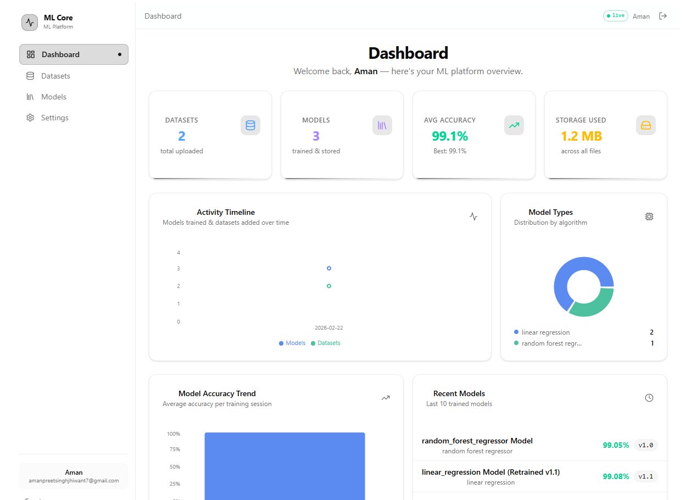
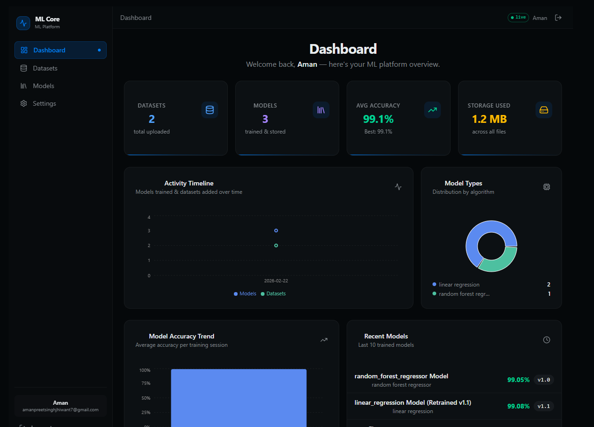

# ML Core

A self-hosted machine learning platform — upload datasets, wrangle data, train models, run predictions, download trained models, and monitor everything from a Grafana-style dashboard.

> **One Docker image. One port. No extra services.**

[](https://opensource.org/licenses/MIT)
[](https://www.python.org/downloads/)
[](https://nodejs.org/)
[](https://hub.docker.com/r/procoder588/mlcore)

---

## Preview

| Light Mode | Dark Mode |
|---|---|
|  |  |

---

## Features

- 📁 **Dataset management** — upload CSV / Excel files, version datasets, explore stats, wrangle (normalise, encode, drop nulls)
- 📊 **Rich statistics** — per-column descriptive stats (count, mean, std, quartiles) + Pearson correlation heatmap
- 🤖 **Model training** — train scikit-learn models (classifiers & regressors) with configurable hyperparameters loaded live from the library
- 🔁 **Retraining & versioning** — retrain any model to create a new version with full lineage tracking
- 🧪 **In-browser testing** — run single-row predictions directly from the UI (Sheet sidebar, not a blocking dialog)
- ⬇️ **Model download** — download trained `.joblib` files for use outside the platform
- 📈 **Dashboard** — live stats: model count, dataset count, accuracy distribution, storage usage
- 🌙 **Dark / Light / System theme**
- 🔐 **JWT authentication** — cookie-based, HTTPOnly
- 🛡️ **Deployment controls** — disable public signup + seed a default admin via environment variables

---

## Quick Start — Docker

```bash
# Docker Hub
docker run -d \
  -p 8000:8000 \
  -v mlcore-db:/data \
  -v mlcore-uploads:/app/server/uploads \
  --name mlcore \
  procoder588/mlcore:latest

# GitHub Container Registry
docker run -d \
  -p 8000:8000 \
  -v mlcore-db:/data \
  -v mlcore-uploads:/app/server/uploads \
  --name mlcore \
  ghcr.io/Amanbig/mlcore:latest
```

Open **http://localhost:8000** — UI and API both served from the same port.

### Environment Variables

All variables are optional — the defaults work immediately. Pass them with `-e` to `docker run` or in a `docker-compose.yml`.

| Variable | Default | Description |
|---|---|---|
| `JWT_SECRET` | `development` | **Set this to a secret value in production** |
| `DISABLE_SIGNUP` | `False` | `True` to hide the Sign Up tab and block the endpoint |
| `DEFAULT_ADMIN_EMAIL` | _(none)_ | Auto-create an admin on first boot |
| `DEFAULT_ADMIN_PASSWORD` | _(none)_ | Password for the auto-created admin |

Example with a locked-down admin-only instance:

```bash
docker run -d \
  -p 8000:8000 \
  -v mlcore-db:/data \
  -v mlcore-uploads:/app/server/uploads \
  -e JWT_SECRET=my-super-secret \
  -e DISABLE_SIGNUP=True \
  -e DEFAULT_ADMIN_EMAIL=admin@mycompany.com \
  -e DEFAULT_ADMIN_PASSWORD=StrongP@ssw0rd! \
  --name mlcore \
  procoder588/mlcore:latest
```

### Volumes

| Volume | Path in container | Purpose |
|---|---|---|
| `mlcore-db` | `/data` | SQLite database — isolated from server code |
| `mlcore-uploads` | `/app/server/uploads` | Datasets + model files |

---

## Development Setup

### Prerequisites

| Tool | Version | Install |
|---|---|---|
| Python | ≥ 3.10 | [python.org](https://www.python.org) |
| uv | latest | see below |
| Node.js | ≥ 18 | [nodejs.org](https://nodejs.org) |

#### Install uv (Python package manager)

```bash
# Windows (PowerShell)
powershell -ExecutionPolicy ByPass -c "irm https://astral.sh/uv/install.ps1 | iex"

# macOS / Linux
curl -LsSf https://astral.sh/uv/install.sh | sh
```

---

### 1 — Server

```bash
cd server

# Install dependencies into an auto-managed .venv
uv sync

# Start with hot-reload
uv run dev        # → http://localhost:8000
```

Interactive API docs: **http://localhost:8000/docs**

---

### 2 — Client

```bash
cd client

# Install dependencies
npm install

# Start dev server (proxies /api/* → :8000 automatically)
npm run dev       # → http://localhost:5173
```

---

### Running both together

Open two terminals:

```
terminal 1 → cd server && uv run dev
terminal 2 → cd client && npm run dev
```

The Vite proxy handles CORS — no extra config needed.

---

## Building a Docker Image Locally

```bash
# From the repo root
docker build -t mlcore:local .
docker run -d -p 8000:8000 --name mlcore mlcore:local
```

The Dockerfile is **multi-stage**:
1. `node:22-alpine` — builds the Vite client (`npm run build`)
2. `python:3.13-slim` — installs the server with `uv`, copies the client build into `server/static/`

---

## CI / CD

Two workflow files in `.github/workflows/`:

```
push to main
    │
    ├─► lint.yml      — ruff (Python) + biome + tsc (TypeScript)
    │                   runs on every push and PR
    │
    └─► release.yml   — full pipeline:
            │
            ├─ lint-server  (ruff)      ─┐
            ├─ lint-client  (biome)      ├─ parallel
            ├─ typecheck    (tsc)       ─┘
            │
            ├─ version  → reads version from pyproject.toml
            │             creates git tag v<X.Y.Z> if new
            │
            ├─ build-and-push → builds Docker image
            │                   pushes to DockerHub + GHCR
            │
            └─ github-release → creates GitHub Release page
                                 with auto-generated changelog
                                 + Docker pull instructions
```

### Releasing a New Version

1. Bump `version` in `server/pyproject.toml`:
   ```toml
   [project]
   version = "0.2.0"
   ```
2. Commit and push to `main`:
   ```bash
   git add server/pyproject.toml
   git commit -m "chore: bump version to 0.2.0"
   git push origin main
   ```
3. The workflow automatically:
   - Creates git tag `v0.2.0`
   - Builds and pushes the Docker image
   - Creates a GitHub Release with changelog

### Required Secrets

Add these in **GitHub → Settings → Secrets and variables → Actions**:

| Secret | Description |
|---|---|
| `DOCKERHUB_USERNAME` | Your Docker Hub username |
| `DOCKERHUB_TOKEN` | Docker Hub → Account Settings → Security → New Access Token (Read & Write) |

`GITHUB_TOKEN` is injected automatically — no setup needed.

---

## Architecture

```
┌─────────────────────────────────────────────────┐
│                 Docker container                │
│                                                 │
│  ┌──────────────────┐   ┌─────────────────────┐ │
│  │   FastAPI        │   │   Vite build        │ │
│  │   /api/*         │   │   served as static  │ │
│  │                  │   │   SPA (index.html   │ │
│  │  auth, datasets, │   │   fallback)         │ │
│  │  models, stats   │   │                     │ │
│  └──────────────────┘   └─────────────────────┘ │
│              uvicorn :8000                      │
└─────────────────────────────────────────────────┘
```

| Concern | Detail |
|---|---|
| **API** | `/api/*` — all backend routes |
| **UI** | Everything else → SPA fallback to `index.html` |
| **Datasets** | `server/uploads/datasets/` |
| **Models** | `server/uploads/models/` |
| **Database** | SQLite — `server/mlcore_db.db` (mount a volume to persist) |
| **Client (prod)** | `server/static/` — Vite build copied in at Docker build time |

---

## Repository Structure

```
MLCore/
├── Dockerfile              Multi-stage build (Node → Python)
├── .dockerignore
├── Readme.md               ← you are here
├── client/                 Vite + React frontend
│   ├── src/
│   ├── biome.json          Linter / formatter config
│   ├── package.json
│   ├── vite.config.ts
│   └── README.md
└── server/                 FastAPI backend
    ├── src/
    │   ├── main.py
    │   └── modules/        auth, dataset, file, ml_model, stats, user
    ├── migrations/         Alembic migrations
    ├── scripts/            CLI entry points
    ├── pyproject.toml      Dependencies + ruff config
    ├── uv.lock
    └── README.md
```

---

## Further Reading

- [Server README](server/README.md) — API reference, migration guide, uv commands
- [Client README](client/README.md) — component structure, Biome, build process

---

## Contributing

Contributions are welcome! Please see the [CONTRIBUTING.md](CONTRIBUTING.md) file for guidelines on how to set up the project locally, run tests, and submit pull requests.

---

## License

This project is licensed under the [MIT License](LICENSE).

